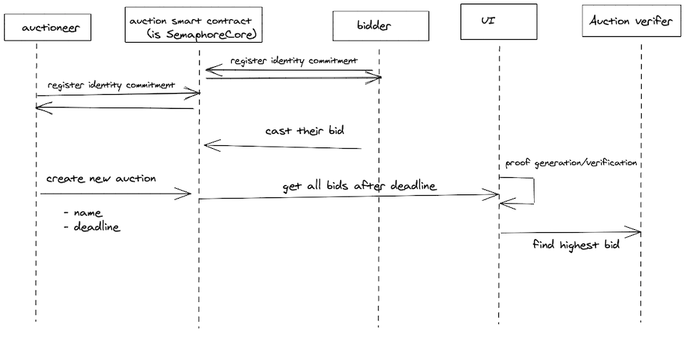

# zkAuction

# Table of content

- [zkAuction](#zkauction)
- [Table of content](#table-of-content)
  - [Proposal Overview](#proposal-overview)
  - [Design](#design)
- [Project Structure](#project-structure)
  - [Smart contract](#smart-contract)
  - [Circuit](#circuit)
  - [Front-end](#front-end)
  - [TODO](#todo)

## Proposal Overview

ZKAuction is a zero knowledge based blind auction that keeps the privacy of the bidders including their addresses and the bid amount. Each bidder deposits a small amount to encourage the bidder to come back and send multiple transactions/proofs. The information about each auction like name, expiration date will be stored on the blockchain. In this time range bidders are allowed to send bids. Once the time is over, the winning bid as well as all other bids could be exposed.

## Design

- Semaphore is uses as an authentication/privacy layer. So the Auction.sol contract is `SemaphoreCore`.
  - Auctioneers and bidders first have to register their identity commitment to interact with the system.
- Auctioneer creates the auction and gives it a name and sets a deadline for bidders.
- This information are stored as a struct on chain.
- bidders go to the website and select the acution. - they cast their bid and the encrypted value and generated secret will be stored on chain.
- by the end of deadline, the system retreives all the bidders info from chain
- then, system uses auction circuit, generates the proof, and reveals the highest bid

In this desing, there is no need for the auctioneer to generate the proof and run verification. There is no centralized database.



# Project Structure

## Smart contract

The `Auction.sol` contract inherits `SemaphoreCore` contract and uses Semaphore as ID authentication. It also used to store auction information on chain. The `Auction` struct stores auction name, expiration date, and also takes array of struct `Bid` to store the encrypted price and the secret.
Any interaction with the smart contract, e.g. `addBid`, requires to verify proof and then call `_saveNullifierHash`.

```javascript
struct Bid {
       uint price;
       string secret;
   }

struct Auction {
    string name;
    uint expire_date;
    bool active;
    Bid[] bids;
}

mapping(uint256 => Auction) public auctions;
```

Link to the `Auction.sol` contract [here](https://github.com/RemiJolian/zkAuction/blob/main/contracts/Auction.sol).

## Circuit

Circuits for this project are in the [circuit](https://github.com/RemiJolian/zkAuction/blob/main/contracts/circuits/) folder.

## Front-end

Run `yarn dev` and then on browser go to [http://localhost:3000](http://localhost:3000) to access the frontend UI.

This system uses Nextjs to interact with smart contract. It uses Seamaphore contracts to verify Seamphore proofs. The following packages are needed:

`yarn add @semaphore-protocol/identity @semaphore-protocol/group @semaphore-protocol/proof --dev`

This project forked the following repository:

- [Semaphore protocol boilerplate](https://github.com/semaphore-protocol/boilerplate)

## TODO

- Improve the circuit
- Encrypt the price in the Auction.sol
- work on the UI
- Deploy to Harmony Testnet
